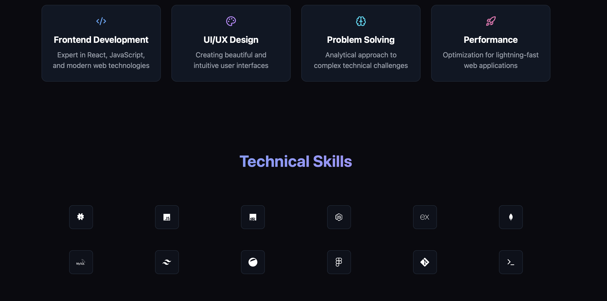

# Portfolio Website

A modern, responsive portfolio website built with React, TypeScript, and Tailwind CSS, featuring a beautiful dark theme and interactive UI elements.



## 🚀 Features

- **Modern Design**: Clean and professional interface with a dark theme
- **Responsive Layout**: Fully responsive design that works on all devices
- **Interactive UI**: Smooth animations and transitions
- **Dynamic Sections**: About, Skills, Projects, and Contact sections
- **Tech Stack Display**: Interactive tech stack showcase with hover effects
- **Contact Form**: Integrated contact form for easy communication

## 🛠️ Technologies Used

- React 18
- TypeScript
- Tailwind CSS
- Vite
- React Router DOM
- Lucide React Icons

## 🏗️ Project Structure

```
portfolio-website/
├── src/
│   ├── components/
│   │   ├── sections/
│   │   │   ├── About/
│   │   │   ├── Contact/
│   │   │   ├── Footer/
│   │   │   ├── Hero/
│   │   │   └── Skills/
│   │   └── ui/
│   ├── icons/
│   ├── pages/
│   └── styles/
├── public/
└── package.json
```

## 🚀 Getting Started

1. **Clone the repository**
   ```bash
   git clone https://github.com/yourusername/portfolio-website.git
   ```

2. **Install dependencies**
   ```bash
   cd portfolio-website
   npm install
   ```

3. **Start the development server**
   ```bash
   npm run dev
   ```

4. **Build for production**
   ```bash
   npm run build
   ```

## 📱 Responsive Design

The website is fully responsive and optimized for:
- Desktop (1024px and above)
- Tablet (768px to 1023px)
- Mobile (below 768px)

## ✨ UI Components

- **GlowingCard**: Reusable card component with hover effects
- **GlowingButton**: Interactive button with gradient effects
- **TechIcons**: SVG icons for various technologies
- **Responsive Navigation**: Mobile-friendly navigation system

## 🎨 Styling

- Custom Tailwind CSS configuration
- CSS animations and transitions
- Gradient effects
- Dark theme optimization


## 👤 Author

**Josean Araujo**

- GitHub: [@Jeanfr1](https://github.com/Jeanfr1)
- LinkedIn: [Josean Araujo](https://www.linkedin.com/in/josean-araujo-3ba63b17b/)

## 🤝 Contributing

Contributions, issues, and feature requests are welcome!
